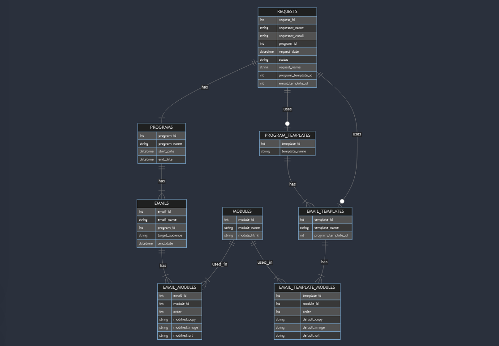

# Journey Builder

Site: <https://hnkl-journey-builder-c2c613aec1b5.herokuapp.com/>

### TechStack

* NodeJS
* Express
* MySQL

### How to Use

* clone the Repo ```git clone```
* install the dependencies ```npm install```
* Create a .env file ```code -r .env```
* ask me for credentials!
* set up DB connection
* Then run ```cd database``` then create database ```node createdb```
* then create tables ```node createtable.js```
* Now, you can run the app and test everything is working
* run ```npm run dev```
* run ```npm run test```

### Diagram


